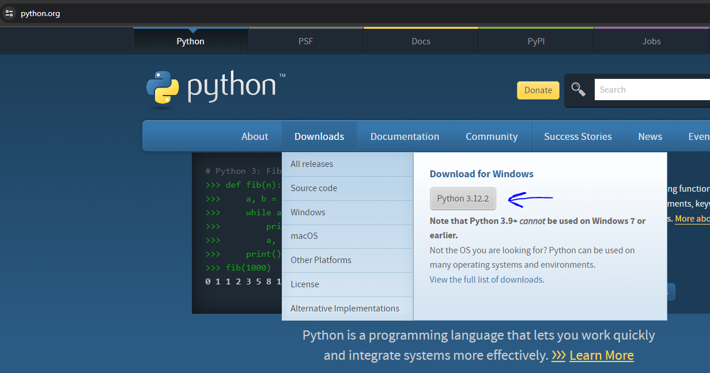
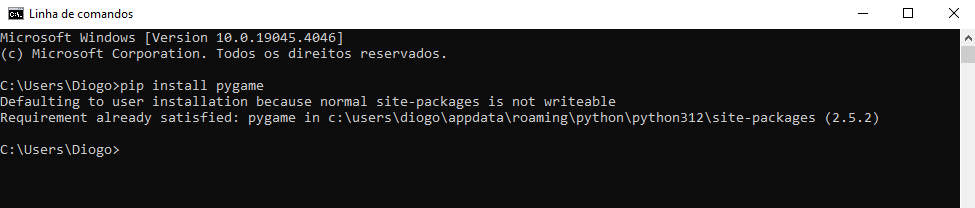

# PyGames
Somes games i decided to try to code with Python

## Instaling Python:

Download Python https://www.python.org/ and on instalation dont forget to press: "Add Python # to Path"

## Instaling Pygames 

On cmd use the command: "pip install pygame"

I already have it installed, but you should see a bar downloading and installing.

If it doesnt work try "pip3 install pygame"

